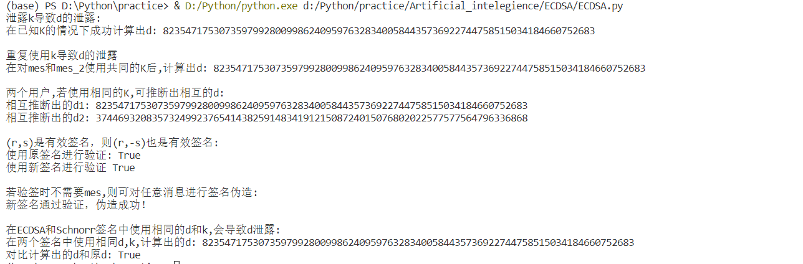
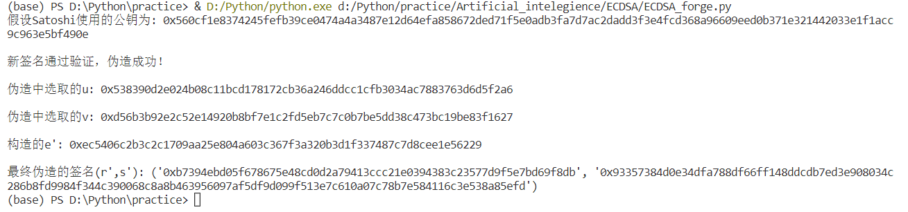

项目说明
===
:heavy_check_mark: **Project: verify the above pitfalls with proof-of-concept code**  
:heavy_check_mark: **Project: forge a signature to pretend that you are Satoshi**  

## 项目介绍  
该项目包含上述两个项目（分别对应`ECDSA.py`和`ECDSA_forge.py`），是以ECDSA算法为例，对ECDSA、Schnorr、SM2-sig算法共同存在的部分缺陷的实现，同时完成签名伪造任务。

 ## 项目完成人
 * **任海（学号：201900460064）**  
 
 ## 运行指导 
 **开发环境：** 
 * Windows Visual Studio Code  
 * Python 3.7.9  
 
 **依赖库：** 
 ```Python
import random
import string
import hashlib
import binascii
import libnum
from ecdsa import SigningKey, NIST256p,numbertheory, ellipticcurve, VerifyingKey
 ```
 
 **ECDSA缺陷代码实现的执行：**  
 * 运行`ECDSA.py`
 * 运行案例截图：
   
  
  **ECDSA签名伪造代码实现的执行：**  
  * 运行`ECDSA_forge.py`
  * 运行案例截图：
   
  
 ## 代码说明
 **ECDSA.py：**  
 
 该文件主要是以ECDSA算法为例，对ESCDA、Schnorr、SM2-sig算法共同存在的部分缺陷的实现，具体如下：
 * 借助`ecdsa`库生成ECDSA签名方案的各项参数：
 ```
 def init_():
    sk = SigningKey.generate(curve=NIST256p) #生成私钥d
    vk = sk.verifying_key  # 生成P的横纵坐标级联
    d = int(sk.to_string().hex(), 16) #d
    P = int(vk.to_string().hex(), 16) #P
    n = sk.curve.order #模数
    K = random.randint(1, n)
    mes = b'Satoshi' #待签名的消息
    sign = sk.sign(mes, k=K, hashfunc=hashlib.sha256) #获取签名值
    r = sign.hex()[:64]  #r
    s = sign.hex()[64:]  #s
    s = int(s, 16)
    r = int(r, 16)
    e = hashlib.sha256()
    e.update(mes)
    e = int(e.hexdigest(), 16)
    return sk,vk,d,P,n,K,mes,sign,r,s,e
 ```
 * 泄露`k`则导致`d`的泄露：
 ```
 def loss_k_loss_d(mes,s,r,K,n,e):
    r_inv = libnum.invmod(r, n)
    d = r_inv * (K * s - e) % n
    print('在已知K的情况下成功计算出d:',d,'\n')
 ```
 * 若重复使用`K`，则可计算出私钥`d`，即私钥`d`也泄露：
 ```
 def reuse_k_loss_d(sk,K,n,e,r,s):
    mes_2=b'renhai'
    sign_2 = sk.sign(mes_2, k=K, hashfunc=hashlib.sha256)
    r2 = sign_2.hex()[:64]
    s_2 = sign_2.hex()[64:]
    e_2 = hashlib.sha256()
    e_2.update(mes_2)
    e_2 = int(e_2.hexdigest(), 16)
    s_2 = int(s_2, 16)
    r2 = int(r2, 16)
    d_2 = (s * e_2 - s_2 * e) * libnum.invmod(s_2 * r - s * r, n) % n  # libnum.invmod用于求逆元
    print('在对mes和mes_2使用共同的K后,计算出d:', d_2,'\n')
 ```
  * 两个用户，使用相同的`K`，则可以相互推断对方的私钥`d`:
  ```
  def  two_k_loss_d(d,K,e,s,n):
    sk_2 = SigningKey.generate(curve=NIST256p) #用户2再生成一个d
    vk_2 = sk_2.verifying_key  # P的横坐标纵坐标级联
    mes_2 = b'renhai'
    sign_2 = sk_2.sign(mes_2, k=K, hashfunc=hashlib.sha256)
    r2 = sign_2.hex()[:64]
    s2 = sign_2.hex()[64:]
    e2 = hashlib.sha256()
    e2.update(mes_2)
    e2 = int(e2.hexdigest(), 16)
    s2 = int(s2, 16)
    r2 = int(r2, 16)
    d2 = (s2 * e - s * e2 + s2 * r * d) * libnum.invmod(s * r, n) % n
    d1 = (s * e2 - s2 * e + s * r * d2) * libnum.invmod(s2 * r, n) % n
    print('相互推断出的d1:',d1)
    print('相互推断出的d2:',d2,'\n')
  ```
  * 若`（r，s）`是有效签名，则`（r，-s）`也是有效签名:
  ```
  #(r,s)是有效签名，则(r,-s)也是有效签名
def  rs_rs(s,sign,vk,mes):
    s_2 = -s % n
    s_2 = hex(s_2)[2:] 
    if len(s_2) % 2:
        s_2 = '0' + s_2
    sign_2 = sign.hex()[:64] + s_2
    sign_2 = binascii.unhexlify(sign_2)
    print('使用原签名进行验证:',vk.verify(sign, mes, hashfunc=hashlib.sha256))
    print('使用新签名进行验证:',vk.verify(sign_2, mes, hashfunc=hashlib.sha256),'\n')
  ```
  * 在CEDSA和Schnorr算法中，使用相同的私钥`d`和`K`，导致私钥`d`泄露:
  ```
  def ecdsa_schnorr(d,sk,mes,K,n,s,r,e):
    G = sk.curve.generator
    e_1 = int(hashlib.sha256((K * G).to_bytes() + mes).hexdigest(), 16)
    s_1 = (K + e_1 * d) % n
    d_1 = (s * s_1 - e) * libnum.invmod(s * e_1 + r, n) % n
    print('在两个签名中使用相同d,k,计算出的d:',d_1)
    print('对比计算出的d和原d:',d_1 == d)
  ```
   **ECDSA_forge.py：**  
   该签名伪造的实质是若验签时不检查消息，则可伪造任意消息的签名：
   ```
   def loss_mes_forge(n,sk):
    u = random.randint(1, n)
    v = random.randint(1, n)
    G = sk.curve.generator
    d = int(sk.to_string().hex(), 16)
    P = G * d
    r1 = (u * G + P * v).x()
    s1 = r1 * libnum.invmod(v, n)
    e1 = r1 * u * libnum.invmod(v, n) % n
    w = libnum.invmod(s1, n) % n
    eg = (e1 * w * G + r1 * w * P)
    if eg.x() == r1:
        print('新签名通过验证，伪造成功！','\n')
        return u,v,r1,s1,e1
   ```
  

