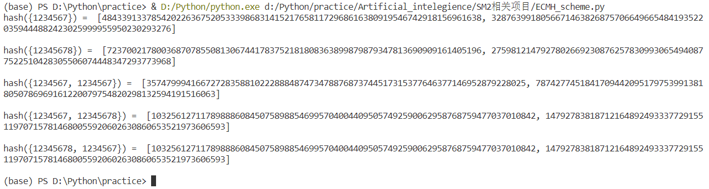

项目说明
===
:heavy_check_mark: **Project: Implement the above ECMH scheme**  
## 项目介绍  
该项目为ECMH方案的实现，将集合中的元素映射为椭圆曲线上的点，然后利用椭圆曲线上的加法求解哈希值。
 ## 项目完成人
 * **任海（学号：201900460064）**  
 ## 运行指导 
 **开发环境：** 
 * Windows Visual Studio Code  
 * Python 3.7.9 
 
 **依赖库：**
 ```Python
import sm3
import numpy as np
import libnum
import sympy
 ```
 
 **ECMH方案代码的执行：**
 * 将`sm3.py`、`ECMH_scheme.py`放入同一文件夹内
 * 运行`ECMH_scheme.py`
 * 运行案例截图：
 

 ## 代码说明
 
 **sm3.py:**  
 
 该文件为SM3算法的实现，作为依赖库为ECMH方案提供Hash操作，由于此前已经做过分析，在此不再赘述。
 
 **ECMH_scheme.py：**  
 
 在代码实现中，主要由计算椭圆曲线加法以及对集合的Hash组成，具体如下：
 * 计算P+Q，在SM2签名算法的实现中已完成，在此不做赘述：
 ```Python
 def double_add(P,Q,param):   
    x1 = P[0]
    y1 = P[1]
    x2 = Q[0]
    y2 = Q[1]
    if x1 == '0' and y1 == '0':        
        return [x2,y2]
    if x2 == '0' and y2 == '0':
        return [x1,y1]
    if x1 != x2:
        y = y2 - y1
        x = x2 - x1
        lam = y * libnum.invmod(x,param[0]) % param[0]
        x3=(lam ** 2 - x1 - x2) % param[0]
        y3=(lam * (x1-x3) - y1) % param[0]
    elif y2 != -1*y1:
        x = 3 * (x1 ** 2) + param[1]
        y = 2 * y1
        lam = x * libnum.invmod(y,param[0]) % param[0]
        x3=(lam ** 2 - x1 - x2) % param[0]
        y3=(lam * (x1-x3) - y1) % param[0]
    else:
        x3='0';y3='0'
    return [x3,y3]
 ```
 * 对集合进行Hash操作：
 ```Python
 def Muli_hash(set):  
    digest = ['0', '0']
    for item in set:
        x = int(sm3.sm3_hash(item), 16)
        tmp = np.mod(x ** 2 + a * x + b, p)
        y = sympy.ntheory.residue_ntheory.nthroot_mod(tmp,2,p) #调库计算二次剩余
        point = [x, y]
        digest = double_add(digest, point, param)
    return digest
 ```
