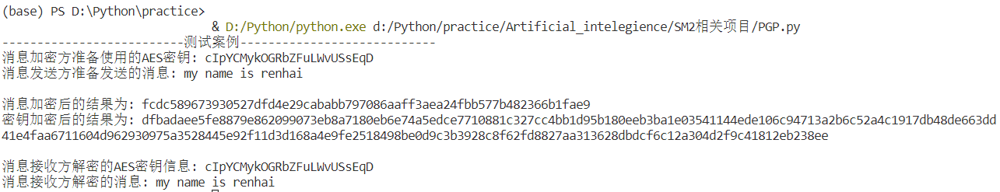

项目说明
===
:heavy_check_mark: **Project: Implement a PGP scheme with SM2**  
## 项目介绍  
该项目为SM2算法的PGP方案的实现，包含`sm3.py`、`sm2_enc.py`、`PGP.py`三部分，其中前两个文件分别为SM3算法、SM2加密算法的实现，作为PGP方案的依赖库导入，第三个文件为PGP方案的具体实现。在PGP方案中，通信双方先协商好一对SM2加密算法的密钥`(sk,pk)`，当需要通信时，消息发送方选取AES算法的密钥`key`，用`key`加密消息`msg`，然后用SM2算法加密密钥`key`，将消息和`key`的加密结果一并发送给消息接收方。消息接收方收到信息后，先用SM2算法解出AES算法使用的`key`，然后用AES算法解出消息信息。流程如下图所示：

 ## 项目完成人
 * **任海（学号：201900460064）**  
 ## 运行指导 
 **开发环境：** 
 * Windows Visual Studio Code  
 * Python 3.7.9  
 
 **依赖库：**  
 * sm2_enc.py
 ```Python
import sm3
import math
import libnum
import hashlib
import random
import binascii
 ```
 * PGP.py
 ```Python
import sm2_enc
from Crypto.Cipher import AES
import binascii
import random
import string
 ```
 
 **SM2算法代码的执行：** 
 * 将`sm3.py`、`sm2_enc.py`文件放入同一文件夹
 * 运行`sm2_enc.py`
 * 运行案例截图：
 
 
 **PGP方案代码的执行：** 
 * 将`sm3.py`、`sm2_enc.py`、`PGP.py`文件放入同一文件夹
 * 运行`PGP.py`
 * 运行案例截图：
 
 
  ## 代码说明  
  **sm3.py、sm2_enc.py:**  
  SM3算法的实现已做过阐述，SM2的加密算法与SM2的签名算法相似，在此也不做重点阐述。
  **PGP.py:**  
  在PGP方案的代码实现环节，实际上主要分为消息发送方加密信息和消息接收方解密信息两部分，具体如下：
  * 消息发送方加密信息，用AES加密消息，用SM2加密算法加密AES密钥，并将消息与密钥加密后的结果一并发送给消息接收方：
  ```Python
  def PGP_enc(mes,key,pk):
    cryptor = AES.new(key.encode('utf-8'), AES.MODE_OFB , b'0000000000000000')
    len_mes = len(mes)
    if len_mes % 16 != 0 :
        add = 16 - (len_mes % 16)
    else:
        add = 0
    mes = mes +('0' *add)
    ciphertext = cryptor.encrypt(mes.encode('UTF-8')) 
    AES_mes = binascii.b2a_hex(ciphertext).decode('UTF-8') #使用AES加密消息后的密文
    sm2_key = sm2_enc.Encrypt(key,  pk) #使用sm2算法加密AES使用的密钥key
    return AES_mes,sm2_key
  ```
  * 消息接收方解密信息，先用SM2加密算法解密AES密钥信息，再用密钥解密AES，得到消息：
  ```Python
  def PGP_dec(AES_mes,sm2_key,sk):
    key = sm2_enc.decrypt(sm2_key, sk) #解密由sm2算法加密的key
    cryptor = AES.new(key.encode('utf-8'), AES.MODE_OFB , b'0000000000000000')
    plain_text = cryptor.decrypt(binascii.a2b_hex(AES_mes)) 
    mes = plain_text.decode('utf-8').rstrip('0') #解密消息
    return key,mes
  ```
