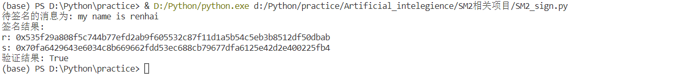

项目说明
===
:heavy_check_mark: **Project: impl sm2 with RFC6979**  
## 项目介绍 
该项目为SM2签名算法的实现（对应`SM2_sign.py`），同时引入`RFC6979`，以实现对`k`的确定性生成。由于随机数`k`的选取可能会导致一系列的密钥泄露（详细参见项目：Project: verify the above pitfalls with proof-of-concept code），因此在`RFC6979`中，采用确定性生成的方式，来规避这些漏洞，以公式`k=SHA256(d+Hash(msg))`，引入密钥、消息的信息，将`k`的安全性保障交给`SHA256`的抗碰撞性。
 ## 项目完成人
  * **任海（学号：201900460064）**  
 ## 运行指导 
 **开发环境：** 
 * Windows Visual Studio Code  
 * Python 3.7.9  
 
 **依赖库：**  
 * SM2_sign.py  
 ```Python
import secrets
import sm3
import libnum
import hashlib
 ```


 **SM2签名算法代码的执行：**  
 * 将`sm3.py`、`SM2_sign.py`放于同一文件夹内
 * 运行`SM2_sign.py`
 * 运行案例截图：
   
 

  ## 代码说明  
  
  **SM2_sign.py**  
  SM2的签名算法主要由预计算、密钥生成、签名、验证等步骤组成，具体如下：
 * **初始化参数**  
 该部分主要根据国密局给出的规范定义设置`p`、`a`、`b`、`n`、`Gx`、`Gy`等参数
 ```
 def init_():
    p=int('0xFFFFFFFEFFFFFFFFFFFFFFFFFFFFFFFFFFFFFFFF00000000FFFFFFFFFFFFFFFF',16)
    a=int('0xFFFFFFFEFFFFFFFFFFFFFFFFFFFFFFFFFFFFFFFF00000000FFFFFFFFFFFFFFFC',16)
    b=int('0x28E9FA9E9D9F5E344D5A9E4BCF6509A7F39789F515AB8F92DDBCBD414D940E93',16)
    n=int('0xFFFFFFFEFFFFFFFFFFFFFFFFFFFFFFFF7203DF6B21C6052B53BBF40939D54123',16)
    gx=int('0x32C4AE2C1F1981195F9904466A39C9948FE30BBFF2660BE1715A4589334C74C7',16)
    gy=int('0xBC3736A2F4F6779C59BDCEE36B692153D0A9877CC62A474002DF32E52139F0A0',16)
    param=[p,a,b,n]
    G=[gx,gy] #G
    ID_A = '0x31323334353637383132333435363738'
    z,dA,pA = Precompute(param,ID_A,G)
    return param,G,z,dA,pA,n
 ```
 * **预计算**  
 计算`ZA`，由于计算过程中需要`SM3`，因此引入此前实现的`SM3`代码
 ```
 def Precompute(param,ID_A,G):
    ENTL_A = padding(hex((len(ID_A)-2)*4),2)
    x_G=hex(G[0])
    y_G=hex(G[1])
    a=hex(param[1])
    b=hex(param[2])
    dA=secrets.randbelow(param[3])
    pA=k_add(dA,G,param)
    x_A = hex(pA[0])
    y_A = hex(pA[1])
    Z = (ENTL_A+ID_A+a+b+x_G+y_G+padding(x_A,32)+padding(y_A,32)).replace('0x','')
    Z_h = sm3.sm3_hash(Z)
    return (Z_h,dA,pA)
 ```
 * **生成密钥**  
 生成`dA`、`k`等密钥，其中生成`k`时，引入`KFC6979`，利用公式`k=SHA256(d+Hash(msg))`，确定性计算`k`
 ```
 def generate_k(mes,d):
    Hash_m = sm3.sm3_hash(mes)
    mes_new = hex(d) + Hash_m
    k_hex = hashlib.sha256((mes_new).encode('utf-8')).hexdigest()
    k = int(k_hex,16)
    return k
 ```
 * **计算签名**  
 根据SM2的定义计算消息签名值
 ```
 def sm2_sig(mes,param,z,G,dA):
    M=z+mes
    e=int(sm3.sm3_hash(M),16)
    p,n=param[0],param[3]
    r,s,k=0,0,0
    while (r==0 or r+k==n or s==0):
        #使用RFC6979生成随机数k
        k=generate_k(mes,dA)
        x_1=(k_add(k,G,param))[0]
        r=(e+x_1)%n
        s=(((libnum.invmod(1+dA,n))%n)*((k-r*dA)%n))%n
    return (mes,hex(r),hex(s))
 ```
 * **验证函数**  
 根据SM2的定义编写验证函数，若验证通过，则输出`True`，若验证不通过，则输出`False`
 ```
 def verify(mh,rh,sh,param,z,G,pA): #其中m,r,s,z都是十六进制数
    #首先把r,s都变成数
    r=int(rh,16)
    s=int(sh,16)
    if (1<=r<=(n-1)) and (1<=s<=(n-1)):
        mm=z+mh            #其中z是十六进制数
        e=int(sm3.sm3_hash(mm),16)    #其中mm,eh都是十六进制数
        t=(r+s)%n
        if t==0:
            return 0
        a=k_add(s,G,param)
        b=k_add(t,pA,param)
        x_1=double_add(a,b,param)[0]
        R=(e+x_1)%n
    return (R == r)
 ```
 * **实例测试**  
 以`my name is renhai`为消息进行签名、验证
 
