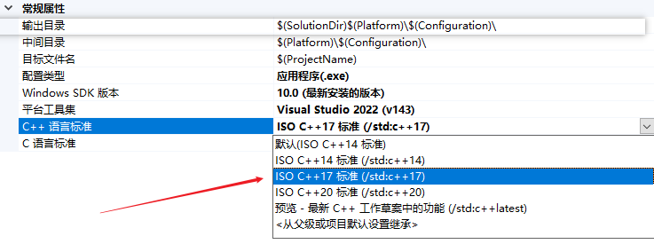
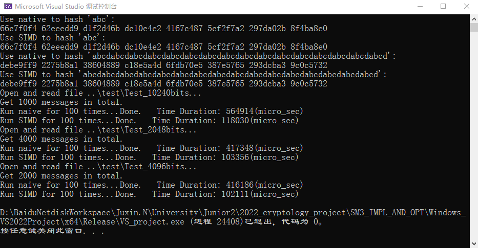
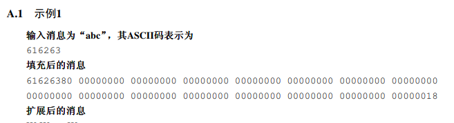
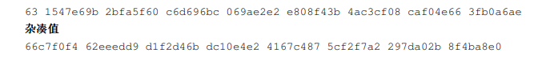
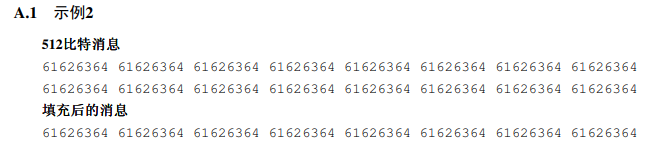
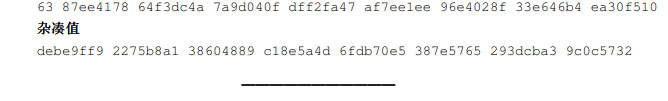

# SIMD的朴素（Naive）实现以及SIMD加速实现

## Run

### Run on Windows

**`Windows_VS2022Project`中的工程用于在Windows上运行。双击文件夹中的`VS_project.sln`即可打开工程，直接运行**。

**环境：**

- 在Windows上运行应该拥有2022 Community版本以上的Visual Studio。

- C++版本应该被设置为C++ 17（或者更高）。

  

- 支持如下的SIMD函数（**否则会抛出异常**）：

  ```C++
  _mm256_set1_epi32();
  _mm256_loadu_epi32();
  _mm256_storeu_epi32();
  _mm256_add_epi32();
  _mm256_or_epi32();
  _mm256_xor_epi32();
  _mm256_and_epi32();
  _mm256_andnot_epi32();
  _mm256_slli_epi32();
  ```

### Run on Linux

**Linux上的工程使用Makefile。如果环境支持，打开shell，使用`make`命令即可生成名为`linux_run`的可执行文件**。

**环境：**

- 使用的GCC应该满足如下的编译命令：

  ```
  g++ -O2 -std=c++17 -mavx2 -mavx -mavx512f -mavx512vl
  ```

- 支持如下的SIMD函数（与Windows上不同，**如果出现不支持的函数会提示`Illegal Instruction`**）：

  ```c++
  _mm256_set1_epi32();
  _mm256_store_epi64();
  _mm256_load_si256();
  _mm256_add_epi32();
  _mm256_slli_epi32();
  _mm256_or_si256();
  _mm256_xor_si256();
  _mm256_and_si256();
  _mm256_andnot_si256();
  ```


## 代码说明

**SM3_basic**:

SM3_basic中包含了实现SM3的一些基础的内容。具体包括：

```C++
// 用于实现循环移位。
#define WORD_ROTATE_LEFT(X, len)  (((WORD)(X) << len) | ((WORD)(X) >> (32 - len)))
// 将0-16的整型转化为'0'-'F'的字符型（IO used）。
char int2char(uint8_t input);
// 用于对消息进行padding，并转化为512比特对齐的blocks。
void* msg2blocks_with_padding(const char* msg, size_t msglen, size_t& blocklen);
// 用于输出结果。
const char* word2string(const void* buffer, size_t wordlen);
```

**SM3_naive** 和 **SM3_simd**：

SM3_naive 和 SM3_simd分别用来实现朴素的SM3算法和SIMD加速的SM3算法，这些算法都是使用类来实现：

- 由于`simd`加速的SM3实现需要并行地对最多8个消息进行运算，因此`push_msg()`接受一个`const std::array<const void*, 8>&`类型的变量作为参数。
- `msg_expansion` 和 `compress`函数分别用来实现消息扩充和轮压缩过程。
- `sm3`是对`msg_expansion` 和 `compress`函数的合并，也是向外提供的顶层方法。
- `get_hash_str`用于接受Hash结果。

> **关于SIMD加速实现的SM3算法**：
>
> 在这里SIMD加速的方法是：**Hash data from multiple independent streams at the same time**.
>
> 再Naive中实现的一系列辅助函数，包括：
>
> ```C++
> #define FF_0_15(X, Y, Z)	( (WORD)(X) ^ (WORD)(Y) ^ (WORD)(Z) )
> #define FF_16_63(X, Y, Z)	( ((WORD)(X) & (WORD)(Y)) | ((WORD)(X) & (WORD)(Z)) | ((WORD)(Y) & (WORD)(Z)) )
> 
> #define GG_0_15(X, Y, Z)	( (WORD)(X) ^ (WORD)(Y) ^ (WORD)(Z) )
> #define GG_16_63(X, Y, Z)	( ((WORD)(X) & (WORD)(Y)) | ((~(WORD)(X)) & (WORD)(Z)) )
> 
> #define P0(X)	( (WORD)(X) ^ WORD_ROTATE_LEFT(X, 9) ^ WORD_ROTATE_LEFT(X, 17) )
> #define P1(X)	( (WORD)(X) ^ WORD_ROTATE_LEFT(X, 15) ^ WORD_ROTATE_LEFT(X, 23) )
> ```
>
> 在SIMD加速实现中均使用SIMD替换实现：
>
> ```c++
> static inline __m256i SIMD_word_rotate_sll (__m256i mm_val, size_t imm);
> static inline __m256i SIMD_P0(__m256i mm_val);
> static inline __m256i SIMD_P1(__m256i mm_val);
> static inline __m256i SIMD_FF_0_15(__m256i A, __m256i B, __m256i C);
> static inline __m256i SIMD_FF_16_63(__m256i A, __m256i B, __m256i C);
> static inline __m256i SIMD_GG_0_15(__m256i A, __m256i B, __m256i C);
> static inline __m256i SIMD_GG_16_63(__m256i A, __m256i B, __m256i C);
> ```
>
> 另外，在代码中也可以看到对`compress`和`msg_expansion`的SIMD加速实现。

**main**：

main中有两个函数，分别是`sm3_test()`和`performance`。其中：

- `sm3_test()`分别使用Naive和SIMD加速的SM3对消息`abc`和消息`abcdabcdabcdabcdabcdabcdabcdabcdabcdabcdabcdabcdabcdabcdabcdabcd`进行Hash，并输出结果。这主要是为了验证正确性。
- `performance`使用`test`文件夹中的测试数据进行性能的测试。

这两个函数的结果见下文（结果展示部分）。


## 结果展示

在Windows上的运行截图如下所示：



### 正确性

首先，程序对`abc`和`abcdabcdabcdabcdabcdabcdabcdabcdabcdabcdabcdabcdabcdabcdabcdabcd`进行加密，分别得到Hash值为

```
66c7f0f4 62eeedd9 d1f2d46b dc10e4e2 4167c487 5cf2f7a2 297da02b 8f4ba8e0
debe9ff9 2275b8a1 38604889 c18e5a4d 6fdb70e5 387e5765 293dcba3 9c0c5732
```

这和国家密码管理局颁布的《SM3密码杂凑算法》（https://www.oscca.gov.cn/sca/xxgk/2010-12/17/1002389/files/302a3ada057c4a73830536d03e683110.pdf）中的“附录A 运算示例”是一致的。









### SIMD

从上面的运行结果可以看出，SIMD的运行时间是Naive的运行时间的20.9%、24.8%和26.9%，即**分别加速了4.78、4.03和2.71倍**。