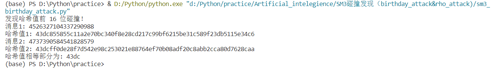

项目说明
===
:heavy_check_mark: **project: implement SM3**   
:heavy_check_mark: **project: implement the naïve birthday attack of reduced SM3**  
:heavy_check_mark: **project: implement the Rho method of reduced SM3**  
## 项目介绍 
该项目中主要包含上述三个project，首先用Python实现SM3算法（对应`sm3.py`），随后分别根据**生日攻击方法**、**Rho方法**，实现针对SM3算法的碰撞攻击（分别对应`sm3_birthday_attack.py`、`sm3_rho_attack.py`），最终成功找到一对Hash值前**32bit**相等的消息，具体如下：  
 * 消息1：`'c563692c21e31639f127ffc500d142bae4b7a6746a69397d9eae124bc47c4527'`
 * 哈希值1：`'687fcd9eea0c49dac2714ef40d9bbcafaa614b63e40ef5092803251fc78212c5'`
 * 消息2：`'7e2a72bb73f3c68b5e585822458b2536ac5b787152dabd70c7bf8c8c7ab1512f'`
 * 哈希值2：`'687fcd9ec430f9dbc2f9d1e6f2c447dd873c88580ff325aa6586272fd669094d'`
 * 对比哈希值1与哈希值2，可知其前32位均为`'687fcd9e'`  
 ## 运行指导 
 **开发环境：** 
 * Windows Visual Studio Code  
 * Python 3.7.9  
 
 **依赖库：**  
 ```Python
 import random
 ```
 
 **SM3算法代码的执行：**  
 * 运行`sm3.py`
 * 运行案例截图：
  

 **生日攻击方案代码的执行：**  
 * 将`sm3.py`、`sm3_birthday_attack.py`文件放于同一文件夹内
 * 运行`sm3_birthday_attack.py`
 * 运行案例截图：
     

  **Rho攻击方案代码的执行：**  
  * 将`sm3.py`、`sm3_rho_attack.py`文件放于同一文件夹内
  * 运行`sm3_rho_attack.py`
  * 运行案例截图：
      
 
 ## 代码说明
 **sm3.py:**  
 
 该文件是对SM3算法的实现，根据算法的具体内容，主要包括消息填充、消息扩展、迭代压缩、输出函数等部分，详细情况如下：
 * 压缩函数：对消息进行padding，填充至512bit的倍数，并以字节形式返回  
    
 * 消息扩展：先将一个512位数据分组划分为16个消息字，并且作为生成的132个消息字的前16个，再用这16个消息字递推生成剩余的116个消息字。  
    
 * 迭代压缩：SM3的迭代过程采用Merkle-Damgard结构，使用消息扩展得到的消息字进行运算。
    
 * 主函数，负责调用各功能函数，对消息进行Hash操作。
     
   
  **sm3_birthday_attack.py**  
 
 该文件是利用生日攻击的方法对SM3算法寻找碰撞。若需要找前32位相同的碰撞，按照生日攻击的理论，对2^16
