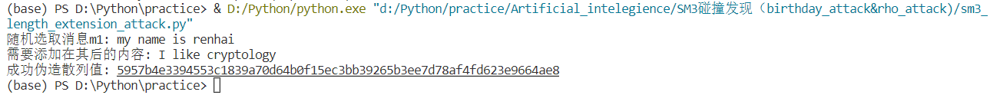
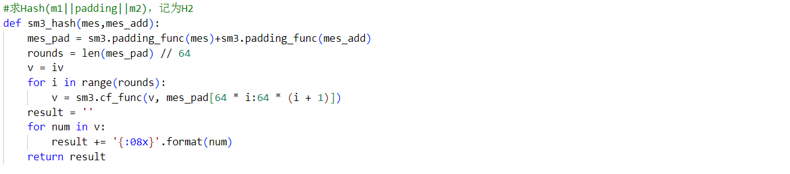
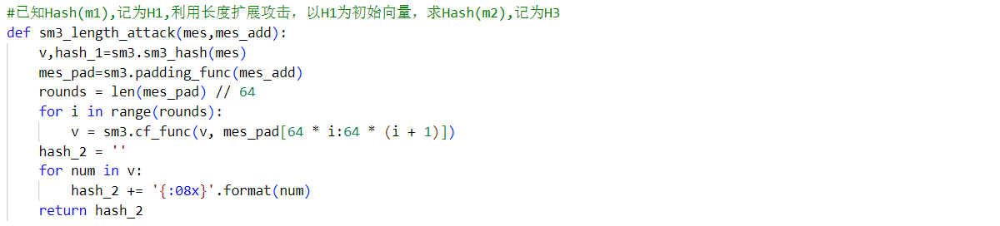
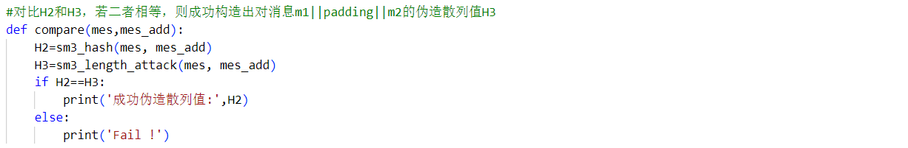

项目说明
===
:heavy_check_mark: **Project: implement length extension attack for SM3, SHA256, etc.**  

## 项目介绍  

该项目实现了对SM3算法的长度扩展攻击，主要原理及步骤如下：
 * 首先随机选取消息M1`(此处为'my name is renhai')`，利用SM3算法`(此处sm3.py与前一项目中稍有改动)`计算其Hash值，记为H1；
 * 选取想要在其后添加的消息M2（此处使用`'I like cryptology'`），求Hash(M1||padding||M2)，记作H2；
 * 将H1作为初始的8个向量，求Hash(M2)，得到H3；
 * 比较H2和H3，若二者相等，则伪造成功。在该过程中，实际上并不需要知道M1的具体内容，只需知道其长度即可；
 * 在该项目中，伪造出的散列值为`'5957b4e3394553c1839a70d64b0f15ec3bb39265b3ee7d78af4fd623e9664ae8'`。
 
  ## 项目完成人
 * **任海（学号：201900460064）** 
 
  ## 运行指导 
 **开发环境：** 
 * Windows Visual Studio Code  
 * Python 3.7.9  
 
 **长度扩展攻击代码的执行：**
  * 将`sm3.py`、`sm3_length_extension_attack.py`文件放于同一文件夹内  
  * 运行`sm3_length_extension_attack.py`
  * 运行案例截图：
    
  
  ## 代码说明  
  
  该项目包含`sm3.py`、`sm3_length_extension_attack.py`两个文件，前者是SM3的实现算法，在长度扩展攻击中对各消息值进行Hash操作，作为模块导入至后者。`sm3_length_extension_attack.py`是对前文提到的长度扩展攻击步骤的实现，主要为三步，具体如下：
  * 计算Hash(m1||padding||m2)，记为H2  
     
  * 已知Hash(m1),记为H1,利用长度扩展攻击，以H1为初始向量，求Hash(m2),记为H3  
     
  * 对比H2和H3，若二者相等，则成功构造出对消息m1||padding||m2的伪造散列值H3  
   
