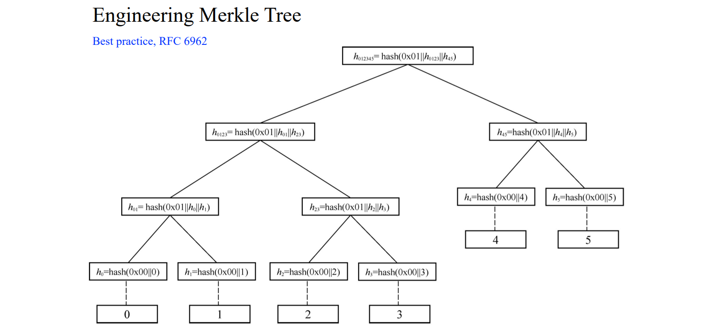
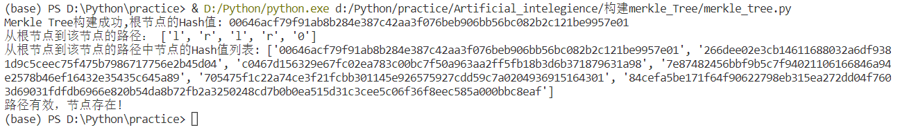

项目介绍
===
:heavy_check_mark: **Project: Impl Merkle Tree following RFC6962**  
## 项目介绍  
该项目遵照RFC6962标准，实现Merkle Tree。Merkle Tree类似于二叉树，叶子节点和树节点中的值均为Hash值，其结构如下图所示。计算过程中，自底向上，两两配对，并添加前缀码，若叶子节点个数为奇数，则末尾节点上移一层参与计算。
   
 ## 项目完成人
 * **任海（学号：201900460064）**  
 ## 运行指导 
 **开发环境：** 
 * Windows Visual Studio Code  
 * Python 3.7.9  
 
  **依赖库：**  
 ```Python
import hashlib
import random
import string
 ```
 **Merkle Tree代码执行**  
 * 运行`merkle_tree.py`
 * 运行案例截图：
    
 * 在上图案例中，首先生成由10w个叶子节点组成的Merkle Tree，输出根节点的Hash值。最后指定需要验证的节点：root.left.right.left.right，即验证从根节点起，左右左右四步后的节点是否存在。验证过程中返回从根节点到待验证节点的路径列表及Hash值列表，路径列表中'l'表示向左，'r'表示向右，'0'表示到达指定节点，Hash值列表中存储着路径上经过节点的Hash值。
  
 ## 代码说明
 整套代码主要由类结构定义、构造Merkle Tree、生成路径、验证节点等组成，具体如下：
 * **定义Merkle Tree的类结构**  
 包括左子节点、右子节父节点、兄弟节点、是否为根节点、是否为父节点的左子树、本节点的值、Hash值等。
 ```Python
 class TreeNode():
    def __init__(self, value):
        self.left = None  # 左子节点
        self.right = None  # 右子节点
        self.parent = None  # 父节点
        self.brother = None  # 兄弟节点
        self.is_root = False  # 判断是否为根节点
        self.is_left = False  # 判断是否为父节点的左子树
        self.value = value  # 叶子结点的值
        self.hash_value = hashlib.sha256(('0x00'+value).encode('utf-8')).hexdigest()  # 叶子节点的hash值
 ```
 * **构造Merkle Tree**  
 输入叶子节点列表，返回根节点。对于叶子节点中的每一个数值，把第`i`个当作左子节点，并且修改它的类结构中的左子节点标记，第`i+1`个作为右子节点，如果最后有节点剩余，就把它放到树的上一层进行计算，需要注意，在最底层计算时，需要加上前缀`0x00`。把第`i`个和`i+1`个的Hash值级联在一起进行Hash操作，作为他们父节点的值，补全父节点和左右子节点类结构中的对应关系，需要注意，树节点在计算时需要加上前缀`0x01`。
 ```
 def construct_tree(leave_list):
    nodes=[]
    for i in leave_list:
        nodes.append(TreeNode(i))
    while len(nodes) != 1:
        tmp=[]
        for i in range(0,len(nodes),2):
            node_left = nodes[i]
            node_left.is_left = True
            if (i+1) < len(nodes):
                node_right = nodes[i+1]
            else:
                tmp.append(nodes[i]) #对于奇数的情况，放入上一层进行计算
                break
            connect = node_left.hash_value + node_right.hash_value #级联，用于计算父节点

            #设置父节点
            parent = TreeNode(connect)
            parent.left = node_left
            parent.right = node_right
            parent.hash_value= hashlib.sha256(('0x01'+connect).encode('utf-8')).hexdigest() 
            #由于叶子节点和树节点的hash计算方式不同，此处需特别注明

            #关联左子节点和右子节点的信息
            node_left.parent = parent  # 左子节点的父节点是parent
            node_right.parent = parent  # 右子节点的父节点是parent
            node_left.brother = node_right  # 左子节点的兄弟是node_r
            node_right.brother = node_left  # 右子节点的兄弟是node_l
            node_left.is_left = True

            tmp.append(parent)
        nodes=tmp #此时相当于进行了最底层的计算，将tmp中的节点复制给nodes
    #当nodes中只剩一个元素时，为根节点，补充其信息
    node_root=nodes[0]
    node_root.is_root=True
    return node_root
 ```
 * **生成路径**  
 给定某一节点，生成根节点到该节点的路径及路径上经过节点的Hash值列表。若该节点有父节点，则先将该节点放入列表，用`'0'`表示；若该节点不是根节点，则将该节点的兄弟节点放入列表；若该节点是左子节点，则路径中用`'l'`表示，若该节点是右子节点，则路径中用`'r'`表示；循环遍历。
 ```
 def  track_path(node):
    path=[]
    hash_value_list=[]

    if node.parent :
        hash_value_list.append(node.value)
        path.append('0')
    
    while not node.is_root : #遍历节点
        hash_value_list.append(node.brother.hash_value)
        if node.is_left:
            path.append('l')
        else:
            path.append('r')
        node = node.parent
    hash_value_list.append(node.hash_value)

    path.reverse()
    hash_value_list.reverse()

    print('从根节点到该节点的路径：',path) #输出路径
    print('从根节点到该节点的路径中节点的Hash值列表:',hash_value_list) #输出路径上节点的Hash值
    return path,hash_value_list
 ```
 * **验证节点**  
 首先生成该节点的路径，然后迭代验证路径上每一节点的Hash值是否正确。
 ```
 def verify_path(path,hash_value_list,root):
    tmp_node = root
    #用'l'、'r'、'0'分别表示路径中左子节点、右子节点、终点
    for item in path:
        if item == 'l':
            tmp_node = tmp_node.left
        elif item == 'r':
            tmp_node = tmp_node.right
        elif item == '0':
            break
    
    for i in range(0,len(hash_value_list)):
        if i == 0:
            if hash_value_list[i] != tmp_node.value:
                #print('false') 调试中使用
                return False
            continue

        if tmp_node.is_root:
            return True
        if tmp_node.is_left:
            tmp_hash = hashlib.sha256(('0x01'+ tmp_node.hash_value + hash_value_list[i]).encode('utf-8')).hexdigest()
            if tmp_hash != tmp_node.parent.hash_value:
                return False
            tmp_node = tmp_node.parent
        else:
            tmp_hash = hashlib.sha256(('0x01' + hash_value_list[i] + tmp_node.hash_value).encode('utf-8')).hexdigest()
            if tmp_hash != tmp_node.parent.hash_value:
                return False
            tmp_node = tmp_node.parent
 ```
 * **测试案例**  
 获取由`10w`个随机字符串组成的叶子节点列表，调用构造函数生成MerKle tree，然后指定某一结点为待验证节点，调用验证函数进行验证。
 ```
 def  get_string_list():
    example_list=[]
    for j in range(0, 100000):
        random_str = ''.join(random.sample(string.ascii_letters + string.digits, 10))# 生成长度为10的随机字符
        example_list.append(random_str)
    return example_list
```
 

